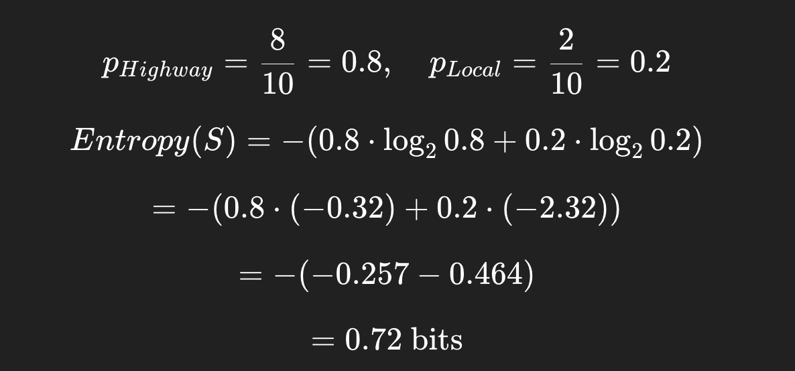
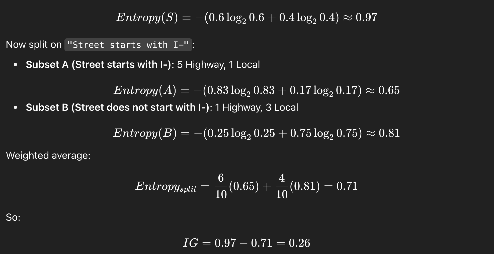

# Classification 

## Learning Objectives

* Understand the difference between supervised and unsupervised learning
* Implement and explain basic classification (e.g., decision trees) and clustering (e.g., K-means) algorithms
* Use real-world traffic incident data to solve classification and clustering problems
* Interpret model outputs and performance metrics


Definition: Classification is the task of predicting a label or category for input data. In our case, we might classify an incident based on its description as a "Crash", "Traffic Hazard", or "Loose Livestock".


### Real-Life Analogies

* **Spam filter**: Given the contents of an email, predict whether it's "Spam" or "Not Spam".
* **Doctor's diagnosis**: Based on symptoms, classify a disease.
* **Campus security**: Given an incident report, predict if it's high priority.


### Algorithm Focus: Decision Trees


#### How It Works

* A **decision tree** splits the data based on the features to reduce uncertainty.
* Each split is a "yes/no" question (e.g., *Does the incident description contain 'crash'?*)
* It continues splitting until it can confidently assign a label.


#### Intuitive Explanation

Think of playing 20 Questions, where you narrow down the object by asking binary questions. A decision tree is doing exactly that—asking a series of smart questions to guess the right label.


#### Math Behind It

* **Entropy** (information gain): measures uncertainty. Lower entropy \= more confidence.


**Entropy formula** from Information Theory, which is also used inside **Decision Trees** (like ID3, C4.5, CART) to decide where to split the data.

**What it means:**  

* **S** = a dataset (or subset) at a node in the tree.
* **n** = the number of possible classes (e.g., "Highway" vs "Local" → 2 classes).
* **pi** = the proportion (probability) of examples in class i within dataset S.
* **log₂** = base-2 logarithm, which measures information in "bits."

### Intuition

* Entropy measures **uncertainty or impurity** in the dataset.
* If all samples belong to a single class then entropy = 0 (pure, no uncertainty).
* If samples are evenly split between classes then entropy is maximum (most uncertain).

## Example with Highway vs Local:

Say at some node:

* 8 incidents are Highway
* 2 incidents are Local  



So this node has some uncertainty (not perfectly pure), but leaning strongly toward "Highway."  

### Information Gain:

#### Step 1: Entropy

If a node is perfectly pure (all "Highway"), entropy = 0.  
If it's a 50/50 split (max uncertainty), entropy = 1 (for binary classification).  


#### Step 2: Splitting the Data

Suppose we're trying to classify **Highway vs Local**.  We pick a feature (say, `"Street Name starts with 'I-'` → interstate).  Splitting on this feature divides the dataset into **subsets**.

* Subset A: incidents where `Street starts with I-`
* Subset B: incidents where `Street does not start with I-`

Each subset will have its own entropy.


#### Step 3: Weighted Average Entropy After Split

After the split, the **expected entropy** is:


* The algorithm chooses the feature/split that **maximizes information gain**.
* Sj = subset j
* ∣Sj∣/∣S∣ \= proportion of samples in that subset


#### Step 4: Information Gain

The **information gain** tells us how much uncertainty was reduced:

IG(S,feature)=Entropy(S)−Entropysplit

* If IG is **high**, that feature is a great split (makes subsets purer).
* If IG is **low**, the feature doesn't help much.

## Example with Numbers

Say we have 10 traffic reports:

* 6 Highway, 4 Local

**Entropy before split:**




### Interpretation:  
 
Splitting on "Street starts with I-" reduces uncertainty (good feature). The decision tree will prefer this feature if no other feature has higher information gain.

---

## Classification Lecture: Highway vs Local

### Learning Objectives

By the end of this lesson, students will:

* Understand the difference between simple queries, logistic regression, and decision trees for classification.
* Be able to classify incidents as Highway vs Local using `location` or `address`.
* Visualize and interpret a Decision Tree.
* Critically think about feature engineering and model limitations.

---

## Simple Query / Filtering Approach

**Concept:** Use keywords to classify incidents without ML.

This works because `location`/`address` contains highway identifiers.

```
import pandas as pd

# Load dataset
df = pd.read_csv("austin_traffic_incidents.csv")

# Highway keywords
highway_keywords = ["I-35", "IH-35, "US 183", "Mopac", "Loop 1", "SH 71"]

# Classify using simple filter
df['road_type'] = df['address'].fillna("").str.upper().apply(
    lambda x: "Highway" if any(k.upper() in x for k in highway_keywords) else "Local"
)

print(df['road_type'].value_counts())
```

**Teaching Notes / Analogy:**

Think of this like a "keyword detector", a quick rule-of-thumb classifier.

**Student Challenge:**

* Modify the code to include **more highway identifiers**.

* Count how many incidents are classified differently if you add/remove keywords.

---

## Logistic Regression in a nutshell


### The Problem

* **Linear Regression** predicts continuous values (like predicting temperature or house price). 
* But sometimes we want to predict **categories** (e.g., “Highway” vs “Local” or “Accident” vs “Non-Accident”). 


### The Trick

* Logistic Regression takes a **linear combination of inputs** (like Linear Regression does), but instead of outputting any number on the real line, it squashes it into a range **between 0 and 1** using the **sigmoid function**:


### The Output

The output is interpreted as a **probability**:

  * If P(y=1|x)>0.5 → predict **class 1** (e.g., Highway).
  * If P(y=1|x)<=0.5 → predict **class 0** (e.g., Local).


### Why It's Useful

* Logistic Regression is one of the **simplest, most interpretable classification algorithms**.
* It's often a **baseline model** before trying more complex ones (like Decision Trees, Random Forests, or Neural Nets).

* It gives you **probabilities**, not just a hard class label, which can be very valuable.

---

**In the Austin Traffic dataset example**:  
 We could use Logistic Regression to classify whether an incident is on a **Highway** (1) or **Local road** (0) based on features like latitude, longitude, issue\_reported, etc.

## Logistic Regression Baseline

**Concept:** Use `address` text and/or `issue_reported` as features.

* Convert text to numeric with `CountVectorizer` or `TfidfVectorizer`.


### Side quest: `CountVectorizer`

* **Turns text into numbers by counting words.**
* It builds a **vocabulary** of all unique words across your dataset.
* Each text entry (like an incident description) becomes a vector where each dimension is the **count of a word** in that entry.

Example:  Suppose we have three reports:

1. "Crash on highway"

2. "Stalled vehicle"

3. "Crash on local road"

Vocabulary = `[crash, on, highway, stalled, vehicle, local, road]`

Vectors:

* "Crash on highway" → `[1,1,1,0,0,0,0]`

* "Stalled vehicle" → `[0,0,0,1,1,0,0]`

* "Crash on local road" → `[1,1,0,0,0,1,1]`

---

### `TfidfVectorizer` (Term Frequency–Inverse Document Frequency)

* Similar to `CountVectorizer`, but instead of raw counts, it weighs words by how **important** they are.
* Common words like "on" or "road" appear in many reports → less informative → **down-weighted**.
* Rare but meaningful words like "fatality" or "hazmat" get **higher weight**.  
* Logistic Regression predicts **probability of Highway vs Local**.

```
from sklearn.model_selection import train_test_split
from sklearn.feature_extraction.text import CountVectorizer
from sklearn.linear_model import LogisticRegression
from sklearn.metrics import classification_report

# Features and labels
X = df['address'].fillna("")
y = (df['road_type'] == "Highway").astype(int)

# Text to numeric features
vectorizer = CountVectorizer()
X_vec = vectorizer.fit_transform(X)

# Train/test split
X_train, X_test, y_train, y_test = train_test_split(X_vec, y, test_size=0.2, random_state=42)

# Train Logistic Regression
clf = LogisticRegression(max_iter=200)
clf.fit(X_train, y_train)

# Evaluate
y_pred = clf.predict(X_test)
print(classification_report(y_test, y_pred))
```

**Teaching Notes / Analogy:**

Logistic Regression is like drawing a smooth boundary between Local and Highway based on text features.

**Student Challenge:**

* Try using `issue_reported` instead of `address`.
* Compare performance: which feature gives better classification?

---

### Decision Tree Approach

**Concept:** Visual, interpretable classification.

The tree splits on features like keywords in `address`.

```
from sklearn.tree import DecisionTreeClassifier, plot_tree`  
import matplotlib.pyplot as plt

# Train Decision Tree
tree = DecisionTreeClassifier(max_depth=4, random_state=42)
tree.fit(X_train, y_train)

# Evaluate
print("Accuracy:", tree.score(X_test, y_test))

# Visualize the tree
plt.figure(figsize=(16,10))
plot_tree(tree, feature_names=vectorizer.get_feature_names_out(),
          class_names=["Local", "Highway"], filled=True, fontsize=10)
plt.show()
```

**Teaching Notes / Analogy:**

The Decision Tree is like a flowchart: each node asks a question (“Does the address contain I-35?”) and routes the incident down the appropriate branch.

**Student Challenge:**

* Change `max_depth` and see how the tree grows/shrinks.
* Identify which words/features the tree uses to split.
* Compare Decision Tree vs Logistic Regression performance.

---

### Wrap-Up Discussion Prompts

1. Why might a simple query work well for Highway vs Local? When might it fail?
2. What advantages does ML provide over keyword rules?
3. How could you add additional features (time, lat/lon, issue_reported) to improve classification?
4. How would you evaluate whether Logistic Regression or Decision Tree is “better”?
5. Could you extend this to multi-class classification (e.g., different highway types or traffic incident types)?

---

### Optional Extensions / Challenges

* Predict **peak vs off-peak highway usage** using time features.
* Combine Decision Tree with **latitude/longitude clustering** to see patterns on a map.
* Try **Random Forest** to see if ensemble methods improve accuracy.

