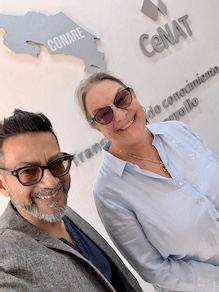

# Costa Rica AI Workshop 2025

Carlos Gamboa (cgamboa@cenat.ac.cr)  
August 18-22, 2025  
Mon-Fri 8:30am - 4:00pm

## Instructors

Charlie Dey, Texas Advanced Computing Center   
<charlie@tacc.utexas.edu>   

Susan Lindsey, Texas Advanced Computing Center   
<slindsey@tacc.utexas.edu>

## Course Evaluation

We appreciate all feedback on this course.  Please help us out and fill out this course evaluation:   
<https://forms.office.com/r/6W106ykMhG?origin=lprLink>.

## TACC Account Information

All students in this workshop are on a temporary "Frontera-Training" allocation.  Your TACC accounts will exist for all time, but you will only have access to Frontera till about one week after the workshop ends.

---

Frontera is one of TACC's High Performance Computing (HPC) resources.  You can access Frontera via these methods:

* SSH - Secure Shell Protocal
* VSCode
* TACC Anlysis Portal  - web interface to common applications on Frontera

* Our Frontera reservation for the workshop.

	* `frontera.tacc.utexas.edu`
	* Reservation numbers: 

		* CR-AI-school-mon
		* CR-AI-school-tue
		* CR-AI-school-wed
		* CR-AI-school-thu
		* CR-AI-school-fri 

* In order to log into and run jobs on TACC resources you must:

	* have an active TACC User Account
	* be added to an active project/allocation

---

## References

* [TACC Documentation](http://docs.tacc.utexas.edu)
* [TACC Account Portal](https://accounts.tacc.utexas.edu/login?redirect_url=profile) - Manage your TACC account and view your allocations
* [TACC Analysis Portal (TAP)](https://tap.tacc.utexas.edu/) 
* [Frontera User Guide](https://docs.tacc.utexas.edu/hpc/frontera/)
* [Multi-Factor Authentication at TACC](https://docs.tacc.utexas.edu/basics/mfa/)

